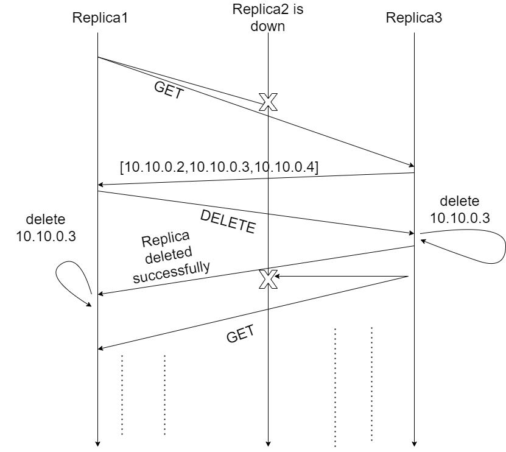

# Ensuring Causal Consistency

## causal-metadata
For our causal-metadata, we pass in an array of length 4: [R1, R2, R3, P]
- [R1, R2, R3] represent the Vector Clock values for each of our three replicas
- P indicates what the position of the sender replica is
  -  For example, if Replica 1 was sending its VC [2, 0, 2], causal-metadata would be [2, 0, 2, 0]

## Causal Broadcasts
In order to keep consistent replicas, whichever process serves a request from the client (that updates the key-value store) sends this update to the other replicas. These are PUT and DELETE requests.

We implemented broadcast as a series of unicast messages:
- The sender replica will increment its own position in its VC (since a broadcast is one event), and then send the message to the other replicas on a special replica-to-replica endpoint called */key-value-store-r/*
```
sendersVC[senderposition]++
senderVC[3] = sender position
```

## canDeliver() Algorithm
In order to determine whether a replica can deliver the message it has just recieved, we use the Causal Broadcast Algorithm from Lecture 5, pseudocode below

```
canDeliver(sender vector clock (senderVC), reciever vector clock (thisVC)):

  if the conditions are met, return true:
    senderVC[sender slot] = thisVC[sender slot] + 1
    senderVC[every not sender slot] <= thisVC[every not sender slot]
    
  else return false
```

## Causal Delivery
When a replica recieves a message, it uses the `canDeliver()` conditions to determine if delivering this message would violate causal consistency.

If it is safe, the replica updates its vector clock: max (sender, current) for all values, and delivers the message. It then returns this updated VC and a success message to the sender replica at the replica-only endpoint
  - Note that we do not increment the deliver VC position, since we are not counting delivers as events.
  - In a sense, our VC implementation serves as a timestamp of send messages from each replica. 
    - EG: Let's say replica 1 sends two messages (with VC entries 1 and 2). 
    - If replica 2 recieves message 2 first, its current VC entry for replica 1 will be 0
    - Since 0 + 1 != 2, it knows that it is waiting on one message before it can deliver this one
    - When it recieves the message with VC entry 1, it can deliver (0 + 1 = 1) and update its own VC
    - It can then deliver 2, since 1 + 1 = 2

In order to ensure consistency between replicas, we keep a status of each replica. If this status indicates that the current replica is not fully up to date (meaning it has messages it cannot yet deliver) it is blocked from serving client requests. Once it has resolved and delivered these messages, it becomes unblocked and can now serve requests from the client that it knows will be consistent with other replicas.

# Detecting whether a replica is currently up or not
On a 1 second interval timer, on a separate thread, we perform a health check. The purpose of the health check is to
broadcast GET requests to all other replica's. If a replica or replica's are down, we add the socket address(es) to an
array local to each replica. After broadcasting the GET requests, using the information gathered in the array, we can
broadcast DELETE requests with each socket address in the array in turn. In the case in which all replica's are down, we delete the replica(s) from our personal view. Otherwise if at least two replica's are currently up, then before sending a response back, the receiver replica deletes the socket address received in the DELETE request. The operations involved with the health check are performed indefinitely to ensure that all replica's know as soon as possible when a replica goes down or when it comes back up. Here is a demonstration of how the health check operates when a replica is down:


